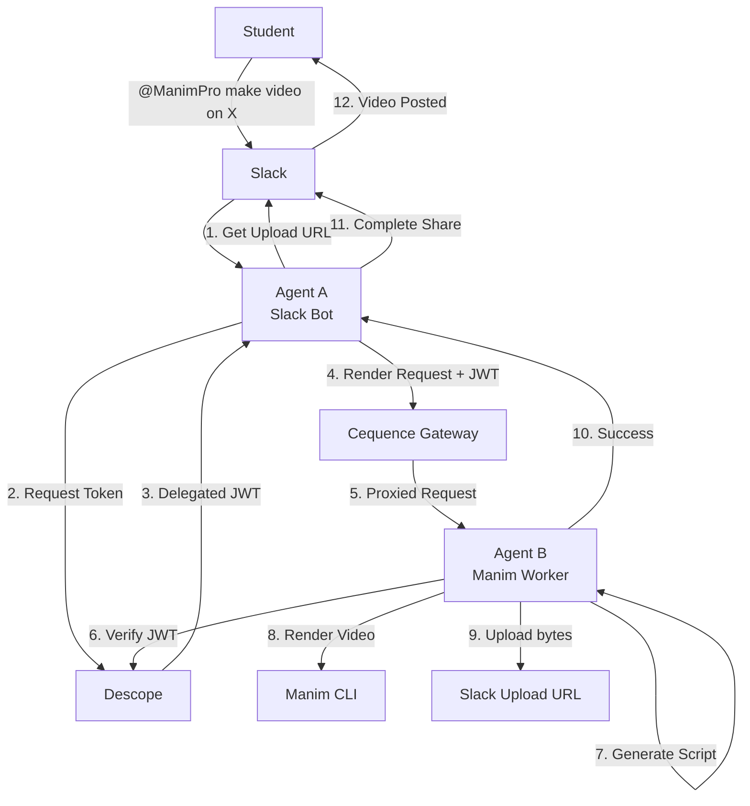

# ManimPro for Slack 🎬

**Agent-to-Agent Educational Video Generation with Secure Delegation**

ManimPro is a hackathon-grade demonstration of secure A2A (Agent-to-Agent) communication that creates educational videos on demand through Slack. Built with **Descope** for authentication, **Cequence AI Gateway** for MCP observability, and **Manim** for beautiful mathematical animations.

## 🚀 Quick Demo

```
Student → Slack DM: "@ManimPro make a video on simple harmonic motion"
                ↓
    🤖 Agent A (Slack Bot): Validates → Gets upload URL → Delegates token
                ↓
    🎬 Agent B (Manim Worker): Verifies token → Renders video → Uploads to Slack
                ↓
    📺 Student receives: Beautiful educational MP4 video
```

## ✨ Key Features

- **🔐 Zero Provider Token Exposure**: Slack upload via pre-signed URLs, no hardcoded tokens
- **🎟️ Secure A2A Delegation**: Descope JWT with scoped, time-limited access
- **👁️ Full Observability**: Cequence AI Gateway provides MCP request/response visibility
- **🎨 Safe Code Generation**: Template-based Manim scripts with injection protection
- **⚡ Modern Slack API**: Uses `getUploadURLExternal` → `completeUploadExternal` flow
- **🛡️ Defense in Depth**: Input validation, sandboxing, resource limits, audit logging

## 🏗️ Architecture



## 🛠️ Quick Start

### Prerequisites

- Docker & Docker Compose
- Slack App with Bot Token
- Descope Project (free tier available)
- Cequence AI Gateway account (optional for full demo)

### 1. Clone and Configure

```bash
git clone <your-repo>
cd descope-hack-manim
cp env.example .env
# Edit .env with your credentials
```

### 2. Set Up Slack App

1. Go to [https://api.slack.com/apps](https://api.slack.com/apps)
2. Create new app → "From scratch"
3. Add Bot Token Scopes:
   - `chat:write`
   - `files:write` 
   - `im:write`
   - `commands` (if using slash commands)
4. Install app to workspace
5. Copy Bot Token, Signing Secret, App Token to `.env`

### 3. Set Up Descope

1. Create project at [https://app.descope.com](https://app.descope.com)
2. Create Inbound App with scopes: `video.create`, `manim.render`
3. Copy Project ID, Management Key, JWKS URL to `.env`

### 4. Launch System

```bash
# Start both agents
docker-compose up -d

# View logs
docker-compose logs -f

# Health checks
curl http://localhost:3000/health  # Agent A
curl http://localhost:8000/health  # Agent B
```

### 5. Test in Slack

```
@ManimPro make a video on simple harmonic motion
```

## 📁 Project Structure

```
├── slack-agent/                 # Agent A - Slack Bot
│   ├── src/
│   │   ├── app.js              # Main Bolt.js application
│   │   └── utils/
│   │       ├── descope.js      # JWT delegation
│   │       ├── validation.js   # Input validation
│   │       └── slack-upload.js # Slack file utilities
│   ├── package.json
│   └── Dockerfile
├── manim-agent/                 # Agent B - Manim Worker
│   ├── src/
│   │   ├── main.py             # FastAPI application
│   │   ├── auth/
│   │   │   └── jwt_auth.py     # JWT verification
│   │   ├── render/
│   │   │   ├── manim_generator.py  # Safe script generation
│   │   │   └── safe_renderer.py    # Sandboxed rendering
│   │   ├── mcp/
│   │   │   └── server.py       # MCP protocol implementation
│   │   └── utils/
│   │       ├── validation.py   # Request validation
│   │       └── file_upload.py  # Slack upload client
│   ├── requirements.txt
│   └── Dockerfile
├── docker-compose.yml           # Local development setup
├── env.example                  # Environment template
└── README.md                    # This file
```

## 🔒 Security Architecture

### Token Flow
1. **Agent A** requests delegated token from Descope with:
   - `audience`: `manimpro-agent-b`
   - `scope`: `video.create manim.render`
   - `act`: `{slack_user_id: "U123456"}`
   - `ttl`: 600 seconds (10 minutes)

2. **Agent B** verifies token against Descope JWKS:
   - Validates signature, expiration, audience
   - Enforces required scopes
   - Extracts "acting for" user context

### Code Generation Safety
- **Template-based**: No arbitrary code execution
- **Allowlist imports**: Only `manim`, `numpy`, `math`
- **Pattern detection**: Blocks dangerous functions/imports
- **Input sanitization**: Strips injection characters
- **Resource limits**: CPU/memory/time constraints

### Upload Security
- **Pre-signed URLs**: No Slack tokens in Agent B
- **Content validation**: File size and type checks
- **Network isolation**: Agents run in separate containers

## 🎯 Demo Script (90 seconds)

1. **Show the ask**: "Student types @ManimPro make a video on simple harmonic motion"

2. **Point to Cequence dashboard**: "Watch the A2A call with scoped JWT"

3. **Show video delivery**: "30 seconds later, educational MP4 appears in DM"

4. **Highlight security**: "No hardcoded tokens, delegated auth, observable calls"

**Key talking points**:
- ✅ **Modern Slack API**: External upload flow (not deprecated `files.upload`)
- ✅ **Zero token leakage**: Agent B never sees Slack credentials
- ✅ **Scope enforcement**: JWT only allows video generation, not user data access
- ✅ **Audit trail**: Every A2A call logged with user context
- ✅ **Template safety**: Generated code is constrained and validated

## 🚀 Production Deployment

### Agent A (Slack Bot)
```bash
# Deploy to your preferred platform
docker build -t manimpro-slack ./slack-agent
docker run -d --env-file .env -p 3000:3000 manimpro-slack
```

### Agent B (Behind Cequence)
1. Deploy container to cloud platform
2. Configure Cequence AI Gateway to proxy Agent B
3. Set `AGENT_B_URL` to Cequence gateway endpoint
4. Enable observability dashboards in Cequence console

### Environment Variables

Copy `env.example` to `.env` and configure:

| Variable | Description | Required |
|----------|-------------|----------|
| `SLACK_BOT_TOKEN` | Slack bot token (xoxb-...) | ✅ |
| `SLACK_SIGNING_SECRET` | Slack signing secret | ✅ |
| `DESCOPE_PROJECT_ID` | Descope project identifier | ✅ |
| `DESCOPE_MANAGEMENT_KEY` | Descope management API key | ✅ |
| `AGENT_B_URL` | Agent B endpoint (or Cequence gateway) | ✅ |
| `DEV_JWT_SECRET` | Development JWT secret (change in prod!) | 🔧 |

## 🔧 Development

### Local Development
```bash
# Install dependencies
cd slack-agent && npm install
cd ../manim-agent && pip install -r requirements.txt

# Run individually
npm run dev  # Agent A on :3000
python src/main.py  # Agent B on :8000
```

### Testing
```bash
# Test Agent A endpoints
curl -X POST http://localhost:3000/slack/events
curl http://localhost:3000/health

# Test Agent B directly (with JWT)
curl -X POST http://localhost:8000/tools/generate_and_render \
  -H "Authorization: Bearer <jwt>" \
  -H "Content-Type: application/json" \
  -d '{"topic": "test", "upload_url": "https://...", "file_id": "F123"}'
```

### Debugging
```bash
# View detailed logs
docker-compose logs -f slack-agent
docker-compose logs -f manim-agent

# Enter containers
docker-compose exec slack-agent sh
docker-compose exec manim-agent bash
```

## 🎨 Supported Video Topics

ManimPro intelligently selects templates based on your topic:

- **Physics**: motion, waves, forces, gravity, oscillation
- **Mathematics**: equations, algebra, calculus, geometry
- **Biology**: cells, DNA, photosynthesis, respiration
- **Computer Science**: algorithms, data structures, programming concepts
- **General**: Any educational topic gets a structured presentation

Example requests:
- "simple harmonic motion" → Physics template with sine wave animation
- "quadratic equations" → Math template with graph plotting
- "photosynthesis" → Biology template with process diagram

## 🎪 Hackathon Extensions

Ready to extend for your hackathon? Here are quick wins:

### Easy Adds (30 min each)
- **Retry button**: Add Slack button to regenerate failed videos
- **Quality options**: Let users choose video resolution/quality
- **Topic suggestions**: Add `/manimpro-suggest` command with examples

### Medium Adds (1-2 hours each)
- **User preferences**: Store preferred video settings per user
- **Batch processing**: Generate multiple related videos
- **Custom captions**: AI-generated explanations under videos

### Advanced Adds (3+ hours each)
- **Voice narration**: Add TTS with educational script generation
- **Interactive elements**: Clickable video annotations
- **Subject-specific templates**: Advanced physics, chemistry, etc.
- **S3 fallback**: Store large videos in S3 with Slack links

## 🤝 Contributing

This is hackathon code - prioritizing working demo over production polish!

### Code Style
- **Slack Agent**: JavaScript with ESLint
- **Manim Agent**: Python with Black formatter
- **Security first**: Validate all inputs, log security events
- **Fail fast**: Prefer clear errors over silent failures

### Pull Requests
1. Fork repo
2. Create feature branch
3. Test with docker-compose
4. Submit PR with demo video/screenshots

## 📜 License

MIT License - Built for educational purposes and hackathon demonstration.

## 🆘 Troubleshooting

### Common Issues

**Slack bot not responding**
- Check bot is installed in workspace
- Verify `SLACK_BOT_TOKEN` starts with `xoxb-`
- Check bot has required scopes

**Agent B render failures**
- Ensure Docker has enough resources (4GB+ RAM)
- Check Manim dependencies installed correctly
- Verify Python 3.11+ compatibility

**JWT verification errors**
- Confirm `DESCOPE_JWKS_URL` is correct
- Check system clocks are synchronized
- Verify Descope project configuration

**Upload failures**
- Validate Slack upload URL format
- Check network connectivity to Slack
- Ensure video file under 100MB

### Getting Help

1. Check logs: `docker-compose logs -f`
2. Verify health endpoints: `/health` on both agents
3. Test MCP capabilities: `GET /mcp/capabilities` on Agent B
4. Join our Discord/Slack for hackathon support

---

**Built with ❤️ for secure, observable agent-to-agent communication**

*Demonstrating the future of AI service interaction with proper authentication, authorization, and auditability.*
